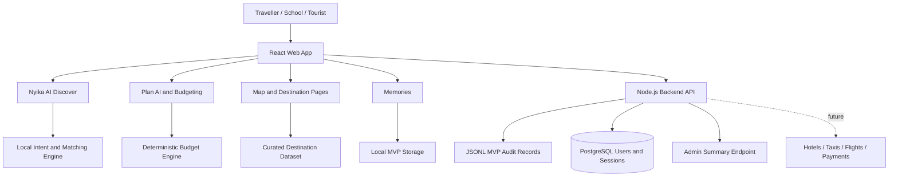

# Technical Architecture

## Figure 1: Nyika AI MVP Architecture

## Components

### React Web App

The frontend is a Vite React application. It contains Home, Explore, Planner, Plan Result, Map, Memories, Business Portal, Admin and Login pages. The UI is responsive and optimized for mobile and desktop demonstrations.

### Nyika AI Discover

The discovery engine interprets user descriptions such as “wildlife and waterfalls with quiet places for photos.” It expands synonyms, detects concepts, scores destination profiles and returns ranked matches. This is where AI-style intelligence is justified because user input is natural, vague and multi-intent.

### Plan AI and Budgeting

The planner parses trip prompts for destination, days, group size and travel style. It then presents a confirmation step before generating a budget. Budget calculations use deterministic rules and destination cost profiles so estimates remain explainable.

### Backend API

The backend is a lightweight Node.js service in `backend/server.mjs`. It supports health checks, consent records, plans, memories, operator leads, admin summary and PostgreSQL-backed authentication.

### PostgreSQL

PostgreSQL is used for login/account readiness. The backend creates `users` and `sessions` tables when `DATABASE_URL` is configured. Passwords are hashed and session tokens are stored as hashes.

### Data Storage

For MVP auditability, consent, plans, memories and operator leads are appended to JSONL files under `backend/storage`. Production should migrate these records to PostgreSQL with retention and access-control policies.

## Hosting Assumptions

- Web build hosted on Hostinger or an equivalent static hosting environment.
- Node.js backend hosted on a Node-capable environment or VPS.
- PostgreSQL hosted through a managed database provider or VPS.
- Production environment variables configured from `.env.example`.

## Known Constraints

- Budgets are estimates and require provider validation.
- Destination images need final production licensing review.
- The mobile app is not yet a separate React Native package.
- Booking, payment, flight and taxi integrations are marked as coming soon.
- Current AI behaviour is local and deterministic, not a hosted LLM.

## Roadmap

1. Complete authenticated user flows and role-based admin access.
2. Move memories, plans and operator leads from JSONL to PostgreSQL.
3. Add verified booking provider integrations.
4. Add formal data retention, export and delete flows.
5. Build React Native mobile package with its own lockfile.
6. Add official tourism datasets and partner price feeds.
